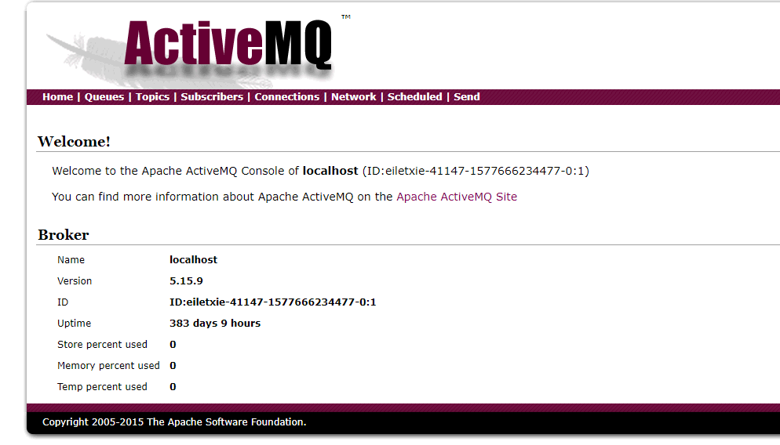

# Apahce ActiveMQ Console控制台弱口令

## 漏洞描述

ActiveMQ默认使用8161端口为Console控制台，存在默认口令 admin:admin

## 漏洞影响

> [!NOTE]
>
> Apahce ActiveMQ

## 漏洞复现

访问目标URL : http://xxx.xxx.xxx.xxx:8161/admin

出现弹窗使用默认口令 admin:admin 进入

